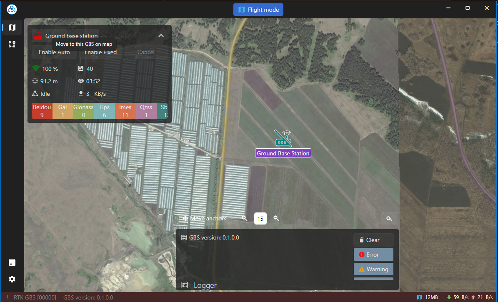
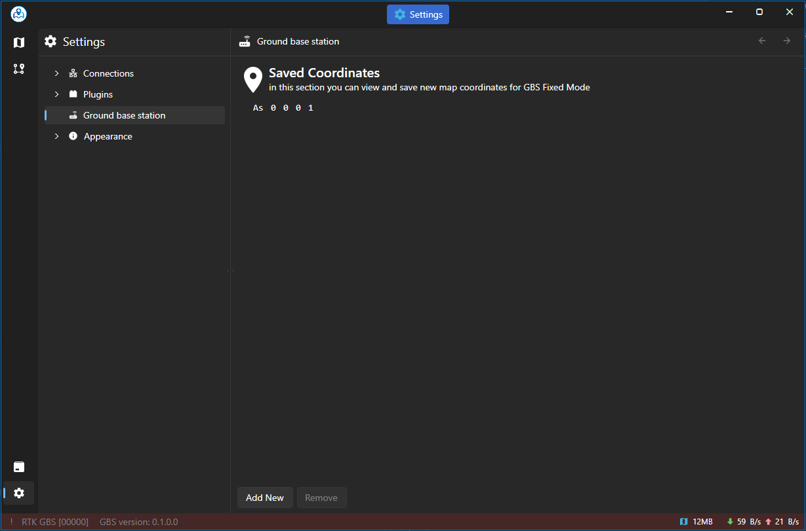

# asv-drones-gui-plugin-gbs

This is a [Asv.Drones](https://github.com/asv-soft/asv-drones) GUI application plugin
for displaying and configuring [Ground Base Station](https://github.com/asv-soft/asv-drones-gbs) devices.

## How to build

Ensure that the following components are installed:
* .NET SDK 8 - https://dotnet.microsoft.com/en-us/download/dotnet/8.0
* AvaloniaUI Templates - https://docs.avaloniaui.net/docs/get-started/install
* Avalonia XAML development - https://docs.avaloniaui.net/docs/get-started/set-up-an-editor

Once these components are installed, follow these steps:

1. Open a terminal and clone this repository using the command `git clone git@github.com:asv-soft/asv-drones-gui-plugin-gbs.git` (the URL may vary);
2. Navigate to the cloned repository folder using `cd asv-drones-gui-plugin-gbs`;
3. Restore NuGet packages in the plugin project with `dotnet restore`, `nuget restore`, or through your IDE;
4. Finally, try to build your project with `dotnet build` or through your IDE.

## How to use

After building the source code of the plugin project, the final library should be placed in the directory of the already built Asv.Drones.Gui application. The next time you launch the application, the CompositionContainer will recognize the library and add it to the common list of libraries loaded at startup.
